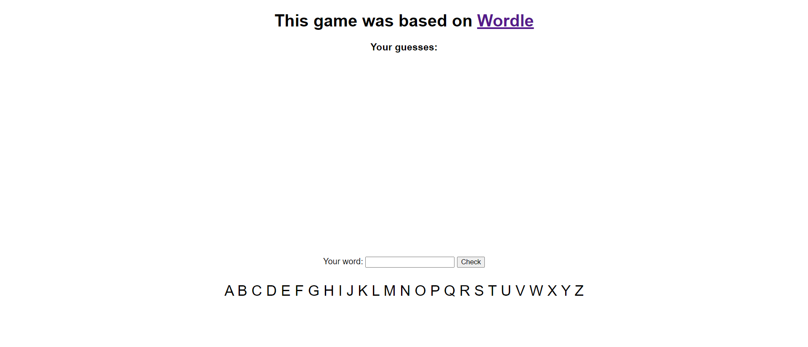
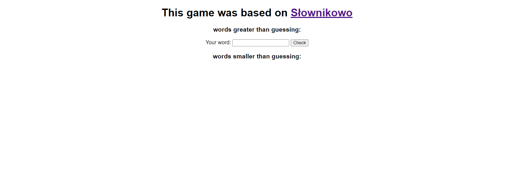

# Word games

This games were written in Python with flask and it is my version of popular games wordle and slownikowo. 
User has to guess the word which is randomly chosen  each time. To play the game you need to run the script and go to the [website](http://127.0.0.1:5000).  
  

